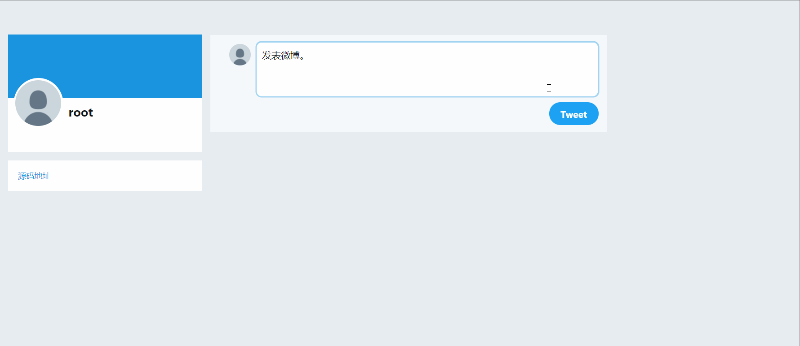
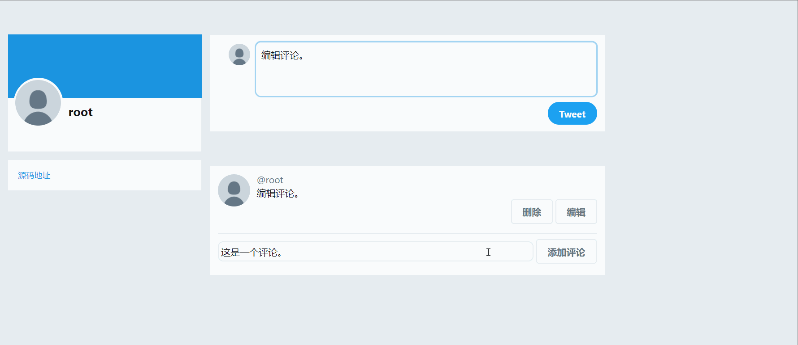

# 介绍

这是基于 Socket 与 HTTP 协议自制的 Web 多线程框架，与在此基础上构建的 Twitter 应用。

# 特点

1.  MVC 架构，多线程
2.  以 JSON 文件作为简易数据库存储数据
3.  使用仿 Jinja 语法的自制模板引擎渲染页面
4.  使用封装的 Ajax 函数实现了局部刷新

# 项目结构

1.  server：基于 Socket 处理接受请求、解析请求、分发路由、发送响应
2.  application：应用程序主题，采用 MVC 结构模式
3.  utils：包括若干工具函数与自制的渲染引擎
4.  data：数据库文件

# 演示

## 注册、登录

## 发表、编辑、删除

## 发表评论、编辑评论、删除评论

